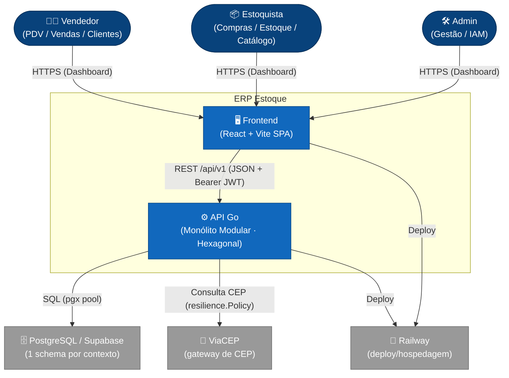

# ERP — Estoque de Loja de Acessórios para Celular

> Sistema de gestão de estoque para loja de acessórios de celular — backend Go (monólito modular, arquitetura hexagonal), PostgreSQL e SPA React/Vite.

-success)     

## 📖 Sobre o Projeto

**ERP de Estoque** é um sistema de gestão para loja de acessórios de celular, desenhado como **monólito modular com arquitetura hexagonal (Ports & Adapters)** e domínios totalmente isolados — cada *bounded context* é um pacote Go autossuficiente, com **1 schema PostgreSQL por contexto** e **sem foreign keys entre schemas**. Essa disciplina mantém os contextos desacoplados e prepara o caminho para uma futura extração em **microsserviços** sem reescrever DDL.

O **frontend** é uma SPA em **React + Vite + TypeScript + Tailwind + shadcn/ui** que conversa exclusivamente com o backend Go via JSON + Bearer JWT.

Código, comentários e documentação são escritos em **português** — esse é o padrão do projeto.

> 📐 **Visão arquitetural completa** (topologia, fluxo de requisição, modelo de dados, domínios e roadmap de microsserviços): **[docs/README.md](docs/README.md)** e **[docs/architecture.md](docs/architecture.md)**.

> ✅ **Estado atual:** **todos os bounded contexts estão implementados em Go** (`iam`, `clientes`, `fornecedores`, `catalogo`, `estoque`, `compras`, `vendas`, `relatorios`) seguindo o mesmo molde hexagonal — `clientes` é a referência canônica. O **frontend cobre todas as telas** e compartilha o kit de UI (com Dark/Light mode). A aplicação está **no ar em produção desde 2026-07-01** (Railway + Postgres no Supabase), com o ciclo de negócio validado no ambiente real.

## 🏗️ Arquitetura

### Contexto do Sistema (C4 Level 1)



### Anatomia de um módulo (bounded context)

Cada domínio é um pacote em `backend/internal/modules/<dominio>/` com camadas estritas, onde as dependências apontam sempre **para dentro** (`adapters → application → ports → domain`):

- **`domain/`** — entidades, value objects, invariantes e erros sentinela. Sem dependência de infra (sem pgx, sem net/http). Validações de negócio vivem aqui.
- **`ports/`** — interfaces. `inbound.go` = o que o módulo **oferece** (casos de uso); `outbound.go` = o que o módulo **exige** (repositórios e gateways).
- **`application/`** — casos de uso (`Service`) que implementam a porta inbound e orquestram domínio + portas outbound. Não conhece HTTP nem SQL; confirma conformidade em compile-time com `var _ ports.X = (*Service)(nil)`.
- **`adapters/inbound/http/`** — `handler.go` (HTTP↔serviço) + `router.go` (rotas + RBAC).
- **`adapters/outbound/postgres/`** — repositórios pgx; `adapters/outbound/cep/` etc. — gateways externos.
- **`module.go`** — *composition root* / DI do contexto: único lugar que conhece implementações concretas, monta tudo e expõe o `Router()`. Cada novo módulo vira uma linha de mount em [`cmd/api/main.go`](backend/cmd/api/main.go) sob `/api/v1`.

### Leis arquiteturais (invariantes)

- **Sem FK entre schemas** — 1 schema Postgres por contexto; integridade cross-context é responsabilidade da aplicação (futuro: eventos/sagas). Comunicação entre módulos só via **portas** declaradas, nunca por JOIN cross-schema.
- **Saldo nunca negativo** (invariante mais crítico) — toda baixa de estoque usa `UPDATE ... WHERE estoque_a_pro >= $qtd` dentro de transação; 0 linhas afetadas = rollback + `409`.
- **Ledger append-only** — `estoque.movimentacoes` é a **fonte da verdade** do saldo; `estoque.ajustes` também é append-only (UPDATE/DELETE bloqueados por trigger). `catalogo.produtos.estoque_a_pro` é cache materializado, atualizado via porta `CatalogoWriter` a cada movimentação.
- **RBAC obrigatório** — toda rota protegida combina `Authenticate` + `RequirePerm("recurso:acao")`.
- **Código em português** — código, comentários e nomes de variáveis/funções.

## ✨ Principais Funcionalidades

- 🧱 **Monólito modular hexagonal** — bounded contexts isolados, prontos para extração futura em microsserviços.
- 🗄️ **Isolamento por schema** — 1 schema PostgreSQL por contexto, sem foreign keys cross-schema.
- 🔐 **Autenticação JWT (HS256) + RBAC** — permissões `recurso:acao` embutidas no token (sem lookup ao banco por request); refresh token rotacionado.
- 📒 **Ledger de estoque append-only** — saldo materializado mantido em sincronia via porta `CatalogoWriter`, com garantia de saldo nunca negativo.
- 🛡️ **Resiliência nos adaptadores outbound** — `Retry → Circuit Breaker → Bulkhead` compostos em `resilience.Policy`, aplicados nas chamadas a APIs externas (ex.: ViaCEP).
- 📮 **Gateway de CEP (ViaCEP)** — consulta de endereço no cadastro de clientes/fornecedores.
- 🖥️ **SPA React/Vite** — todas as telas do ERP sobre um kit de UI compartilhado, com **Dark/Light mode** (tokens semânticos), camada de rede própria com refresh de token automático; servida por nginx em produção.
- 📊 **Observabilidade** — métricas expostas para Prometheus + dashboards Grafana (stack opcional via `docker-compose.observability.yml`).

## 🧩 Módulos / Bounded Contexts

Cada contexto possui seu próprio schema PostgreSQL. **Todos estão implementados em Go** (`clientes` é a referência canônica do molde hexagonal):

| Contexto | Schema | Responsabilidade | Status |
|----------|--------|------------------|--------|
| `iam` | `iam` | Identidade e acesso: usuários, JWT (access/refresh), papéis → permissões; expõe o middleware de authz aos demais módulos. | ✅ Implementado em Go |
| `clientes` | `clientes` | Cadastro de clientes; validação de CPF (11 dígitos, único) + consulta de CEP; status ativo/inativo; rastreia `dt_ult_comp_cli`. | ✅ **Implementado em Go** (referência) |
| `fornecedores` | `fornecedores` | Cadastro de fornecedores; validação de CNPJ (14 dígitos, único) + consulta de CEP; rastreia `dt_ult_comp_for`. | ✅ Implementado em Go |
| `catalogo` | `catalogo` | Categorias e produtos; margem (`custo < venda`), disponibilidade (`disp_pro`); dono do saldo materializado. | ✅ Implementado em Go |
| `compras` | `compras` | Pedidos de compra (cabeçalho + itens); entrada de estoque; caso de uso confirmar-compra. | ✅ Implementado em Go |
| `vendas` | `vendas` | Pedidos de venda (cabeçalho + itens); saída de estoque; documento fiscal (Cupom/NF). | ✅ Implementado em Go |
| `estoque` | `estoque` | Ledger de movimentações + ajustes + saldo; **fonte da verdade** do estoque. | ✅ Implementado em Go |
| `relatorios` | (leitura) | Relatórios de leitura: produtos abaixo do mínimo, mais vendidos, vendas/compras por período. | ✅ Implementado em Go |

**Dependências entre módulos (via portas):** `clientes`/`fornecedores` → `CepGateway`; `catalogo` → `EstoqueReader`; `compras` → `EstoqueWriter`, `CatalogoReader`; `vendas` → `EstoqueWriter`, `CatalogoReader`, `ClienteWriter`, `FiscalGateway`; `estoque` → `CatalogoWriter`; `relatorios` → leitura consolidada (produtos/estoque/vendas/compras).

### Papéis (RBAC)

| Papel | Pode fazer |
|-------|-----------|
| `ADMIN` | Acesso total, incluindo gestão de usuários/IAM (`iam:admin`). |
| `VENDEDOR` | Operar PDV/vendas e gerir clientes; **lê** catálogo e estoque; lê relatórios. |
| `ESTOQUISTA` | Gerir compras, estoque (ajustes/razão), catálogo (categorias/produtos) e fornecedores; lê relatórios. |

Permissões seguem o formato `recurso:acao` (ex.: `vendas:write`, `clientes:read`, `iam:admin`). `recurso:*` cobre `read` + `write` do recurso.

## 🚀 Tecnologias

**Backend (Go 1.25)**

- **Router**: `github.com/go-chi/chi/v5` v5.1.0
- **JWT**: `github.com/golang-jwt/jwt/v5` v5.2.1 (HS256)
- **UUID**: `github.com/google/uuid` v1.6.0
- **Postgres (driver + pool)**: `github.com/jackc/pgx/v5` v5.7.1 (`pgxpool`)
- **Env**: `github.com/joho/godotenv` v1.5.1
- **Hash de senha**: `golang.org/x/crypto` v0.27.0 (bcrypt)
- **Testes**: `github.com/stretchr/testify` v1.9.0
- **Plataforma compartilhada** (`backend/internal/platform/`): `auth` (JWT + RBAC), `httpserver` (chi + middlewares globais + `/health` + envelope de erro `{"error":{"code","message"}}`), `resilience` (Retry/CircuitBreaker/Bulkhead), `observability` (métricas Prometheus), `config`, `database`.

**Frontend**

- **React** ^18.3.1 + **react-router-dom** ^6.27.0
- **Vite** ^5.4.10 + **@vitejs/plugin-react** ^4.3.3
- **TypeScript** ^5.6.3
- **Tailwind CSS** ^3.4.14 + **shadcn/ui** (copy-in; `class-variance-authority`, `clsx`, `tailwind-merge`, `lucide-react`)
- Gerenciado com **pnpm**; alias `@` → `src/`. Em produção é servido por **nginx**.

**Banco de dados & infra**

- **PostgreSQL 16** (local via Docker; gerenciado via **Supabase** em produção)
- **golang-migrate** (`migrate/migrate:v4.18.1`) para migrations versionadas
- **Docker / Docker Compose** (db + migrate + api + frontend)
- **Railway** para deploy de backend e frontend

## 📋 Pré-requisitos

- **Go 1.25+**
- **Docker & Docker Compose**
- **pnpm** (frontend)
- **PostgreSQL 16** (ou use o serviço `db` do Docker Compose / uma instância Supabase)
- **golang-migrate** (ou execute via Docker Compose / Makefile)

## 🔧 Instalação

1. **Clone o repositório**

   ```bash
   git clone https://github.com/lennonconstantino/erp_estoque_loja_celular_v1.git
   cd erp_estoque_loja_celular_v1
   ```

2. **Configure as variáveis de ambiente** (pré-requisito de todos os alvos do Makefile)

   ```bash
   cp backend/.env.example backend/.env
   ```

   > Preencha pelo menos `DATABASE_URL`, `JWT_SECRET` e `DB_PASSWORD`. Antes de qualquer deploy, rode `make check-secrets` — ele falha (exit 1) se `JWT_SECRET`/`DB_PASSWORD` ainda forem os defaults de dev.

3. **Suba a stack completa via Docker**

   ```bash
   make up   # Postgres + migrations + API (:8080) + frontend (http://localhost)
   ```

   Ou siga o desenvolvimento local na seção abaixo.

## ⚡ Como Usar (Makefile)

Há **um único `Makefile` na raiz** que orquestra backend, frontend e infra (faz `-include backend/.env`). Rode todos os alvos a partir da raiz; `make help` lista todos.

### Backend (Go)

```bash
make be-run     # roda a API localmente em :8080  (go run ./cmd/api)
make be-build   # compila o binário em backend/bin/api
make be-test    # roda a suíte de testes (go test ./...)
make be-vet     # go vet ./...
make be-fmt     # formata o código (gofmt -w .)
```

Pacote ou teste único: rode `go test` direto em `backend/` — ex.:
`cd backend && go test -run TestNome ./internal/modules/clientes/domain`.

### Frontend (React/Vite, pnpm)

```bash
make fe-install # instala dependências (pnpm install)
make fe-dev     # sobe o Vite dev server (pnpm dev)
make fe-build   # build de produção (tsc + vite)
make fe-lint    # roda ESLint
```

### Infra (Docker Compose)

```bash
make up            # db + migrations + api + frontend (docker compose up -d --build)
make down          # derruba os containers
make logs          # segue os logs da api (use s=frontend, s=db, ... para outro serviço)
make check-secrets # gate pré-deploy: falha se JWT_SECRET/DB_PASSWORD forem defaults de dev
```

**Observabilidade (stack separada — Prometheus + Grafana):**

```bash
# Subir
docker compose -f docker-compose.observability.yml up -d
# Grafana: http://localhost:3000 (admin/admin) · Prometheus: http://localhost:9090

# Derrubar
docker compose -f docker-compose.observability.yml down
```

**Teardown completo (limpa todos os recursos Docker do projeto):**

```bash
./scripts/docker/teardown.sh                           # containers + volume pgdata + rede
./scripts/docker/teardown.sh --images                  # idem + imagens buildadas
./scripts/docker/teardown.sh --recreate-volume         # idem + recria pgdata vazio
./scripts/docker/teardown.sh --obs                     # idem + Prometheus/Grafana e seus volumes
./scripts/docker/teardown.sh --obs --images --recreate-volume  # tudo
```

### Migrations (golang-migrate)

```bash
make migrate-up                    # aplica todas as migrations
make migrate-down                  # reverte a última migration
make migrate-create name=add_xyz   # cria nova migration
make reset                         # DROP total + recria (inclui seed)
make supabase-setup                # cria + popula um banco remoto (Supabase) — usa backend/.env.production
```

> O seed roda pelo fluxo `reset`/`migrate-up` (a migration `000009_seed` popula os dados iniciais). Não há alvo `seed` standalone.
>
> Os alvos `migrate-*` usam o `migrate/migrate` CLI local. Para **produção** há um
> runner Go embarcado em [`backend/cmd/migrate`](backend/cmd/migrate) (mesmos arquivos
> `migrations/*.sql`): é o binário `/app/migrate` da imagem do backend, executado no
> pre-deploy do Railway (`/app/migrate up`) e usado pelo [`scripts/supabase-setup.sh`](scripts/supabase-setup.sh).

### Agregados

```bash
make build   # be-build + fe-build
make test    # be-test
make lint    # be-vet + fe-lint
```

### Acessos locais

- **API**: http://localhost:8080 (health check em `/health`)
- **Frontend**: http://localhost (porta 80)
- **PostgreSQL**: `localhost:5432` (db `erp_estoque`, user `erp` por padrão)

**Login inicial (seed):** `admin@loja.local` / `admin123` — **troque em produção**.

## 📚 Documentação

A documentação completa está em **[`docs/`](docs/README.md)**.

### Arquitetura — [`docs/architecture/`](docs/architecture/)

- [overview.md](docs/architecture/overview.md) — visão geral: escopo, módulos e regras de negócio
- [hexagonal.md](docs/architecture/hexagonal.md) — Ports & Adapters, fluxo de dependências, stack
- [folder-structure.md](docs/architecture/folder-structure.md) — layout do repositório e anatomia de um módulo
- [domains.md](docs/architecture/domains.md) — domínios (bounded contexts): responsabilidade e regras
- [microservices-roadmap.md](docs/architecture/microservices-roadmap.md) — fases de evolução e estratégia de extração
- [resilience.md](docs/architecture/resilience.md) — Circuit Breaker, Bulkhead e Retry nos adaptadores de saída

### Referência — [`docs/reference/`](docs/reference/)

- [data-model.md](docs/reference/data-model.md) — modelo de dados: tabelas, colunas e relacionamentos
- [api.md](docs/reference/api.md) — API REST: endpoints por módulo
- [security.md](docs/reference/security.md) — autenticação JWT e autorização RBAC
- [checklist.md](docs/reference/checklist.md) — checklist de segurança: gate de revisão pré-deploy

### Setup — [`docs/setup/`](docs/setup/)

- [backend-setup.md](docs/setup/backend-setup.md) — início rápido, Docker, variáveis de ambiente
- [supabase-setup.md](docs/setup/supabase-setup.md) — provisionamento do PostgreSQL gerenciado
- [database-migrations.md](docs/setup/database-migrations.md) — inicialização, migrations e seed
- [frontend-setup.md](docs/setup/frontend-setup.md) — convenções da SPA React, stack e variáveis
- [railway-deployment.md](docs/setup/railway-deployment.md) — deploy no Railway (backend e frontend)

### Runbooks — [`docs/runbooks/`](docs/runbooks/)

- [circuit-breaker.md](docs/runbooks/circuit-breaker.md) — `CircuitBreakerOpen`: diagnóstico e resposta quando um circuit breaker abre

### Outros

- [docs/architecture.md](docs/architecture.md) — arquitetura (visão consolidada): topologia, fluxo de requisição, deploy local/Railway
- [docs/client-brief.md](docs/client-brief.md) — brief do cliente: contexto de negócio, problema, módulos e definição de pronto

## 📂 Estrutura de Pastas

```
.
├── docker-compose.yml                  # orquestração: db + migrate + api + frontend
├── docker-compose.observability.yml    # stack opcional: Prometheus + Grafana
├── Makefile                            # orquestra backend, frontend e infra (make help)
├── scripts/docker/teardown.sh          # limpa todos os recursos Docker do projeto
├── scripts/supabase-setup.sh           # cria + popula um Postgres remoto (Supabase) via cmd/migrate
├── backend/                # serviço Go (hexagonal) — ver backend/CLAUDE.md
│   ├── cmd/api/            # entrypoint da API (main.go monta os módulos em /api/v1)
│   ├── cmd/migrate/        # runner de migrations embarcado (/app/migrate up no Railway)
│   ├── internal/
│   │   ├── platform/       # infra compartilhada
│   │   │   ├── auth/          # JWT HS256 + RBAC
│   │   │   ├── httpserver/    # router chi, middlewares, /health, helpers
│   │   │   ├── resilience/    # Retry + Circuit Breaker + Bulkhead (Policy)
│   │   │   ├── observability/ # métricas Prometheus
│   │   │   ├── config/        # carga de config via env
│   │   │   └── database/      # pool pgx (pgxpool)
│   │   └── modules/        # 1 pacote por bounded context (todos implementados)
│   │       ├── iam/ · fornecedores/ · catalogo/ · estoque/ · compras/ · vendas/ · relatorios/
│   │       └── clientes/   # referência canônica do molde hexagonal
│   │           ├── domain/
│   │           ├── ports/          # inbound.go · outbound.go
│   │           ├── application/
│   │           ├── adapters/        # inbound/http · outbound/postgres · outbound/cep
│   │           └── module.go        # composition root / DI
│   ├── migrations/         # DDL versionada (golang-migrate, 000001–000010)
│   ├── Dockerfile · railway.json · .env.example · .env.production.example
│   └── go.mod
├── frontend/               # SPA React/Vite (pnpm) — ver frontend/CLAUDE.md
│   ├── src/
│   │   ├── components/ui/  # kit de UI compartilhado (PageShell, DataTable, Modal, …)
│   │   ├── lib/            # http · api · auth · env · theme · utils
│   │   ├── pages/          # todas as telas: Login · Dashboard · Clientes · Fornecedores · Categorias · Produtos · Compras · Vendas · NovaVenda · AjustesEstoque · Relatorios · Usuarios
│   │   ├── App.tsx         # rotas + PrivateRoute
│   │   └── main.tsx        # entrypoint
│   ├── Dockerfile · nginx.conf · vite.config.ts · components.json · package.json
└── docs/                   # documentação (ver docs/README.md)
    ├── architecture/ · reference/ · setup/ · runbooks/
    ├── architecture.md · client-brief.md
```

## 🤝 Contribuindo

Contribuições são bem-vindas! Por favor, siga estes passos:

1. Faça um Fork do projeto.
2. Crie uma Branch para sua feature (`git checkout -b feature/MinhaFeature`).
3. Commit suas mudanças (`git commit -m 'Add: minha nova feature'`).
4. Push para a Branch (`git push origin feature/MinhaFeature`).
5. Abra um Pull Request.

**Antes de submeter**, rode as checagens estáticas e os testes:

```bash
make lint   # be-vet + fe-lint
make test   # be-test
make be-fmt # formata o código Go
```

Mantenha o padrão do projeto: **código, comentários e nomes em português**, dependências apontando sempre para dentro (`adapters → application → ports → domain`) e nenhuma rota protegida sem RBAC.

## 📄 Licença

Este projeto é distribuído sob a licença **MIT**. Consulte o arquivo `LICENSE` para mais detalhes.

## 📞 Contato

- **Lennon** — Arquiteto de Software e Desenvolvedor Líder
- 📧 lennonconstantino@gmail.com
