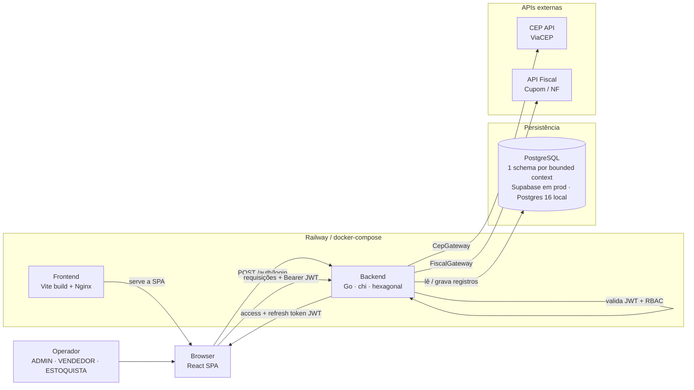

# Arquitetura — ERP Estoque (Loja de Acessórios para Celular)

## Propósito

Este documento descreve a arquitetura-alvo do ERP de estoque: a SPA React, o
backend Go (hexagonal) e a camada de persistência em PostgreSQL. A arquitetura
otimiza para **consistência de estoque e fiscal**: nenhuma venda ultrapassa o
saldo disponível, toda movimentação é rastreável (saldo anterior/posterior) e o
valor confirmado pelo sistema é idêntico ao do documento fiscal emitido.

O sistema roda em dois alvos:

- **Local (desenvolvimento):** `docker-compose` sobe Postgres + migrations + API.
- **Produção:** deploy no **Railway** (frontend + backend) com **Supabase** como
  PostgreSQL gerenciado.

> Diferente de produtos baseados em LLM, **não há** pgvector, embeddings,
> retrieval ou chamadas a provedores de IA. O Supabase é usado **apenas como host
> do PostgreSQL** — o Supabase Auth **não** é utilizado; a autenticação é JWT
> emitida pelo próprio backend Go.

## Arquitetura de alto nível

O diagrama mostra os dois caminhos de execução (local e produção) convergindo
para a mesma topologia lógica: navegador → backend Go → PostgreSQL, com
adaptadores de saída para CEP e documento fiscal.



## Objetivos arquiteturais

- **Navegador fino:** renderiza UI, guarda a sessão (access token em memória,
  refresh token em `localStorage`) e fala com o backend por JSON. Nenhuma regra
  de negócio, nenhuma credencial privilegiada, nenhum acesso direto ao banco.
- **Backend autoritativo:** autenticação, autorização (RBAC), validação de
  invariantes de domínio, transações de estoque, emissão fiscal e toda escrita no
  banco acontecem no Go.
- **Domínios isolados:** cada bounded context é um pacote Go autossuficiente com
  seu próprio schema. Um módulo nunca importa o pacote interno de outro — a
  comunicação é por contratos (portas/eventos).
- **PostgreSQL como estado durável:** usuários, clientes, fornecedores, catálogo,
  compras, vendas e o razão de estoque. Um schema por contexto, **sem foreign key
  entre schemas**.
- **Tipado e testável:** o domínio é puro (entidades + invariantes) e testável em
  memória, sem banco nem HTTP.
- **Deploy simples:** um serviço de frontend (estático) e um serviço de backend
  (stateless) — idêntico entre `docker-compose` e Railway, trocando apenas a
  connection string e os segredos.

## Stack

**Frontend:**

- Vite + React SPA + TypeScript strict (**não é Next.js** — sem SSR/server components)
- React Router para roteamento
- Tailwind CSS + shadcn/ui para UI
- `fetch` nativo via `src/lib/http.ts` e singleton `api` em `src/lib/api.ts`
  (**sem axios/ky/got**)
- Autenticação JWT pelo backend — **sem `@supabase/supabase-js` no frontend**
- Gerenciador de pacotes: **pnpm** (idade mínima de release de 7 dias via `.npmrc`)

**Backend:**

- Go (monólito modular, hexagonal — Ports & Adapters)
- `go-chi/chi` para roteamento HTTP
- `pgx/v5` para acesso ao PostgreSQL (sem ORM pesado)
- `golang-migrate` para DDL versionada (`.up.sql` / `.down.sql`)
- `golang-jwt/jwt` + `bcrypt` para JWT + RBAC
- `joho/godotenv` para configuração; `google/uuid` para IDs
- `httpx` nativo (`net/http`) para chamadas de saída (CEP, fiscal)

**Persistência:**

- PostgreSQL 16 — local via `docker-compose`, produção via Supabase (host gerenciado)
- 1 schema por bounded context (`iam`, `clientes`, `fornecedores`, `catalogo`,
  `compras`, `vendas`, `estoque`)

## Fronteiras do sistema

O **frontend** é responsável pela interação do usuário, estado local de UI e por
enviar a requisição autenticada ao backend. Nunca deve guardar credenciais de
banco, rodar regra de negócio, nem escrever direto no PostgreSQL.

O **backend** é responsável por autorização da requisição, validação de
invariantes, execução das transações de estoque/fiscal, emissão de tokens e toda
persistência durável. É o único componente com acesso ao banco e aos segredos
(`DATABASE_URL`, `JWT_SECRET`).

O **PostgreSQL** é responsável pelo estado durável. Não há lógica de aplicação no
banco além de constraints, triggers de imutabilidade (ajustes append-only) e
`CHECK`s que reforçam invariantes (`p_custo_pro < p_venda_pro`, saldo ≥ 0).

## Fluxo de uma requisição

1. O operador faz login na SPA (`POST /api/v1/auth/login` com e-mail + senha).
2. O backend valida a senha (bcrypt), resolve papéis→permissões e emite
   **access token** (JWT HS256, claims `sub`/`roles`/`perms`/`exp`, ~15min) +
   **refresh token** (opaco, hash em `iam.refresh_tokens`, ~30 dias).
3. A SPA guarda o access token **em memória** e o refresh token em `localStorage`.
4. Cada requisição subsequente envia `Authorization: Bearer <access_token>`.
5. O middleware `platform/auth` valida a assinatura e a expiração do JWT, e
   injeta as claims no contexto da requisição.
6. Um segundo middleware (`RequirePerm("recurso:acao")`) verifica se o token
   contém a permissão exigida pela rota — caso contrário, `403`.
7. O handler chama o **caso de uso** (porta inbound), que orquestra o domínio e
   as portas de saída (repositórios, gateways) dentro de uma transação.
8. O backend responde JSON; ao expirar o access token, a SPA chama
   `POST /api/v1/auth/refresh` (rotaciona o refresh) e repete a requisição.

## Camada de frontend

A SPA permanece um Vite puro. O módulo de cada tela se organiza assim:

- `src/lib/env.ts` valida `VITE_API_BASE_URL` na inicialização.
- `src/lib/http.ts` envolve o `fetch`, aplica a base URL, trata timeouts e
  converte falhas em `ApiError` tipado.
- `src/lib/auth.ts` guarda o access token em memória e o refresh token em
  `localStorage`.
- `src/lib/api.ts` expõe o singleton `api.get/post/put/patch/delete`, injeta o
  Bearer token e renova automaticamente o access token no `401` (quando há
  refresh token).
- `src/pages/*` renderiza as rotas de nível superior (login, dashboard, módulos).
- `src/components/*` renderiza componentes da aplicação; primitivos shadcn em
  `components/ui/`.

A regra arquitetural é estável: **o navegador fala com o backend Go usando o JWT;
o backend é dono de toda a lógica e persistência.**

## Camada de backend (hexagonal)

Cada módulo segue o mesmo formato (exemplo, `catalogo`):

```text
internal/modules/catalogo/
├── domain/                   # CORE — entidades + invariantes, sem infra
│   ├── produto.go            #   garante p_custo < p_venda, disp = (saldo > 0)
│   ├── categoria.go
│   └── errors.go
├── application/              # CASOS DE USO — orquestra domínio + portas de saída
│   ├── service.go
│   └── dto.go
├── ports/
│   ├── inbound.go            #   ProdutoService (o que o módulo oferece)
│   └── outbound.go           #   ProdutoRepository, EstoqueReader (o que exige)
├── adapters/
│   ├── inbound/http/         #   handlers chi → chamam ports.inbound
│   └── outbound/postgres/    #   implementa ports.outbound com pgx
└── module.go                 # WIRING (DI): instancia repos, service e router
```

A regra de dependência aponta **sempre para dentro**:
`adapters → application → ports → domain`. O domínio define a porta; o adaptador
a implementa; o `main` injeta a implementação concreta.

Mapeamento módulo → schema → responsabilidade:

| Domínio | Schema | Responsabilidade | Depende de (porta) |
|---------|--------|------------------|--------------------|
| `iam` | `iam` | Usuários, JWT, papéis e permissões | — |
| `clientes` | `clientes` | Cadastro, CPF, CEP | `CepGateway` |
| `fornecedores` | `fornecedores` | Cadastro, CNPJ, CEP | `CepGateway` |
| `catalogo` | `catalogo` | Categorias, produtos, margem, saldo | `EstoqueReader` |
| `compras` | `compras` | Compras + entrada de estoque | `EstoqueWriter`, `CatalogoReader` |
| `vendas` | `vendas` | Vendas + saída de estoque + doc. fiscal | `EstoqueWriter`, `CatalogoReader`, `FiscalGateway` |
| `estoque` | `estoque` | Razão de movimentações + ajustes + saldo | `CatalogoWriter` |

## Comunicação entre domínios

- **Síncrona, hoje (monólito modular):** via interface pública do outro módulo,
  injetada no caso de uso. Ex.: `vendas` depende de `EstoqueWriter`, implementado
  por `estoque`, injetado no `main`.
- **Assíncrona, alvo (microsserviços):** via **eventos de domínio**
  (`CompraConfirmada`, `VendaConfirmada`, `EstoqueAjustado`). Um barramento
  (NATS/Kafka/RabbitMQ) substitui a chamada direta sem alterar o domínio.

> **Sem foreign key entre schemas.** IDs de outros contextos são guardados como
> UUID "solto"; a consistência é garantida pela aplicação. É isso que permite
> separar os bancos depois.

## Estratégia de estoque (razão + saldo materializado)

O saldo de cada produto (`catalogo.produtos.estoque_a_pro`) é um **cache**. A
**fonte da verdade** é `estoque.movimentacoes` — um livro-razão *append-only*.
Compras, Vendas e Ajustes:

1. gravam seu documento no próprio schema;
2. emitem uma **movimentação** no contexto `estoque` (`COMPRA`, `VENDA`,
   `AJUSTE_ENTRADA`, `AJUSTE_SAIDA`) com `saldo_ant`/`saldo_atu`;
3. o contexto `estoque` atualiza o saldo materializado via `CatalogoWriter` e
   recalcula `disp_pro`.

**Concorrência:** a baixa de saldo usa `SELECT ... FOR UPDATE` (ou
`UPDATE ... WHERE estoque_a_pro >= qtd`) para impedir saldo negativo em vendas
simultâneas. Ajustes são **append-only** — UPDATE/DELETE bloqueados por trigger.

## Comunicação backend ↔ PostgreSQL

O PostgreSQL é apenas a camada de persistência — **não** há Supabase Auth nem RLS
como fronteira de autorização. A autorização acontece no backend (JWT + RBAC).

Regras do backend:

- Usa uma única `DATABASE_URL` (string de conexão de sessão direta).
- Em produção (Supabase): porta **5432**, `sslmode=require` — **nunca** o
  transaction pooler (porta 6543), porque migrations, criação de schema e índices
  exigem comportamento de sessão.
- Em local (`docker-compose`): porta 5432, `sslmode=disable`.
- Cada caso de uso que altera estoque roda em **transação**: grava o documento,
  emite a movimentação e atualiza o saldo atomicamente.

## Modelo de dados

Um schema por bounded context. Tabelas principais:

- `iam`: `usuarios`, `papeis`, `permissoes`, `usuario_papeis`,
  `papel_permissoes`, `refresh_tokens`.
- `clientes`: `clientes` (CPF único, endereço, `dt_ult_comp_cli`).
- `fornecedores`: `fornecedores` (CNPJ único, contatos, `dt_ult_comp_for`).
- `catalogo`: `categorias` (descrição única), `produtos` (custo, venda, saldo
  materializado `estoque_a_pro`, `disp_pro`, estoque mínimo).
- `compras`: `compra_master` + `detalhe_compras`.
- `vendas`: `venda_master` + `detalhe_vendas`.
- `estoque`: `movimentacoes` (append-only, fonte da verdade) + `ajustes`.

Detalhes de colunas e relacionamentos em
[reference/data-model.md](reference/data-model.md).

## Gestão de schema (migrations)

As mudanças de schema são versionadas com **golang-migrate** (arquivos `.sql`),
não pelo dashboard do Supabase. Fluxo:

1. Criar par de arquivos em `backend/migrations/` (`NNNN_descricao.up.sql` /
   `.down.sql`).
2. Aplicar local: `make migrate-up` (ou `docker compose up migrate`).
3. Aplicar em produção: o binário `cmd/migrate` roda como **pre-deploy command**
   no Railway (`/app/migrate up`).
4. Versionar ambos os arquivos no commit.

> A connection string das migrations deve ser a de **sessão direta** (porta 5432).
> Detalhes em [setup/database-migrations.md](setup/database-migrations.md).

## Autenticação e autorização (JWT + RBAC)

- **Access token:** JWT HS256 (~15min) com `sub`, `roles`, `perms`, `exp`.
- **Refresh token:** opaco (~30 dias), hash em `iam.refresh_tokens`, com rotação e
  revogação (logout/roubo).
- **Senhas:** bcrypt em `senha_hash_usr`.
- **RBAC:** modelo `usuario → papéis → permissões` (`recurso:acao`). As permissões
  efetivas são embutidas no JWT no login, evitando ida ao banco a cada request.
- Cada rota declara a permissão exigida; o middleware `platform/auth` a verifica.

Papéis: `ADMIN` (tudo), `VENDEDOR` (vendas, clientes, leitura de catálogo/estoque),
`ESTOQUISTA` (compras, estoque, catálogo, fornecedores). Detalhes em
[reference/security.md](reference/security.md).

## Tratamento de erros

Formato de erro: `{ "error": { "code": "...", "message": "..." } }`.

| Status | Quando |
|--------|--------|
| `401 Unauthorized` | token ausente, expirado ou inválido |
| `403 Forbidden` | usuário autenticado sem a permissão exigida |
| `404 Not Found` | recurso inexistente |
| `409 Conflict` | invariante violada (ex.: item de venda sem saldo) |
| `422 Unprocessable Entity` | payload inválido |
| `502 Bad Gateway` | falha em gateway externo (CEP/fiscal) |
| `500 Internal Server Error` | falha inesperada |

A SPA renderiza mensagens amigáveis e distingue falhas de rede/CORS de falhas
HTTP no cliente `api` compartilhado.

## Configuração

Cada serviço mantém uma única fonte de verdade de configuração.

**Frontend** (`src/lib/env.ts`):

- `VITE_API_BASE_URL`

**Backend** (`platform/config`):

- `APP_ENV`, `APP_PORT` (local) / `PORT` (Railway injeta)
- `DATABASE_URL`
- `JWT_SECRET`, `JWT_ACCESS_TTL`, `JWT_REFRESH_TTL`
- `ALLOWED_ORIGINS` (CORS)
- `CEP_API_URL`, `CUPOM_FISCAL_API_URL`, `NOTA_FISCAL_API_URL`

Nunca leia variáveis de ambiente direto em componentes/handlers — use os módulos
de configuração.

## Shape de deploy

### Local — `docker-compose`

Três serviços orquestrados: `db` (Postgres 16) → `migrate` (golang-migrate,
roda uma vez) → `api` (build do `backend/`), mais `frontend` (opcional, Nginx).

```bash
cp backend/.env.example backend/.env
docker compose up -d        # Postgres + migrations + API em :8080
```

### Produção — Railway

Dois serviços num único projeto:

- **`erp-estoque-backend`** — servidor Go via `backend/Dockerfile`.
  Pre-deploy: `/app/migrate up`. Healthcheck: `/health`.
- **`erp-estoque-frontend`** — build Vite estático servido por Nginx via
  `frontend/Dockerfile`. Healthcheck: `/health`.

O PostgreSQL fica no **Supabase** (não adicione um Railway Postgres). O backend é
**stateless** — todo estado durável vive no Postgres. As variáveis `VITE_*` são
compiladas no build do frontend; defina-as **antes** do `railway up`. Passo a
passo em [setup/railway-deployment.md](setup/railway-deployment.md).

## Sequência de implementação

1. Scaffold do backend Go (hexagonal) e da SPA Vite conforme as convenções.
2. Migrations iniciais: schemas, `iam` (usuários/papéis/permissões), seed do admin.
3. Auth: login/refresh/logout, middleware JWT + RBAC.
4. Cliente `api` no frontend com injeção automática do Bearer token.
5. Módulos de cadastro: `clientes`, `fornecedores`, `catalogo` (categorias/produtos).
6. `estoque`: razão de movimentações + saldo materializado + ajustes append-only.
7. `compras`: master + itens + caso de uso "confirmar compra" (entrada de estoque).
8. `vendas`: master + itens + "confirmar venda" (baixa de saldo + doc. fiscal).
9. Adaptadores de saída: `CepGateway` (ViaCEP) e `FiscalGateway` (cupom/NF).
10. Relatórios (listagens, abaixo do mínimo, mais/menos vendidos).
11. Telas do frontend por módulo + tratamento de erros e estados vazios.
12. Empacotamento de deploy: Dockerfile do frontend (nginx + `/health`), binário
    `cmd/migrate` embarcado na imagem do backend, `railway.json` por serviço
    (pre-deploy `/app/migrate up`, healthcheck) e `scripts/supabase-setup.sh`
    para provisionar o banco gerenciado. Deploy no Railway + Supabase.

## Não-objetivos

- Sem Next.js, SSR, server components ou route handlers no frontend.
- Sem `@supabase/supabase-js`, Supabase Auth ou RLS como fronteira de autorização —
  o Supabase é apenas host do PostgreSQL.
- Sem LLM, embeddings, pgvector ou busca semântica.
- Sem acesso direto ao banco a partir do navegador.
- Sem multi-loja / multi-tenant.
- Sem app mobile, e-commerce ou integração com marketplaces.
- Sem módulo financeiro (contas a pagar/receber) nesta versão.
