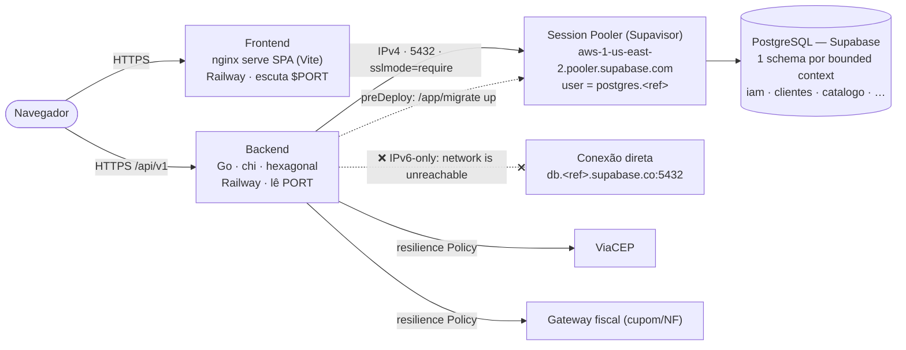
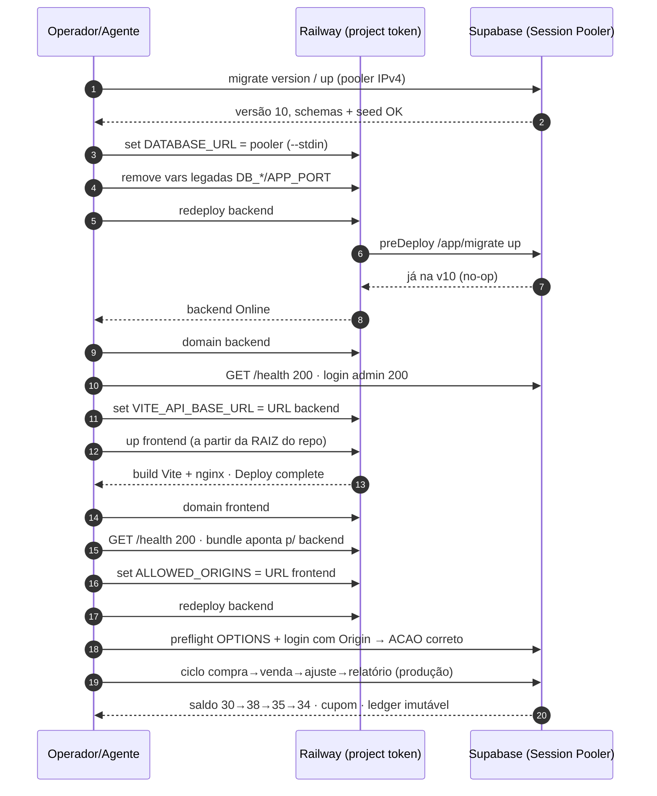
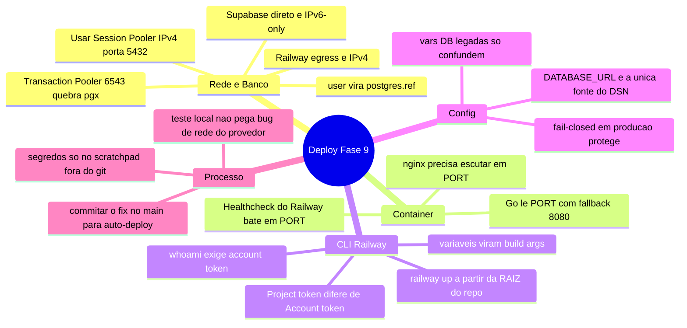
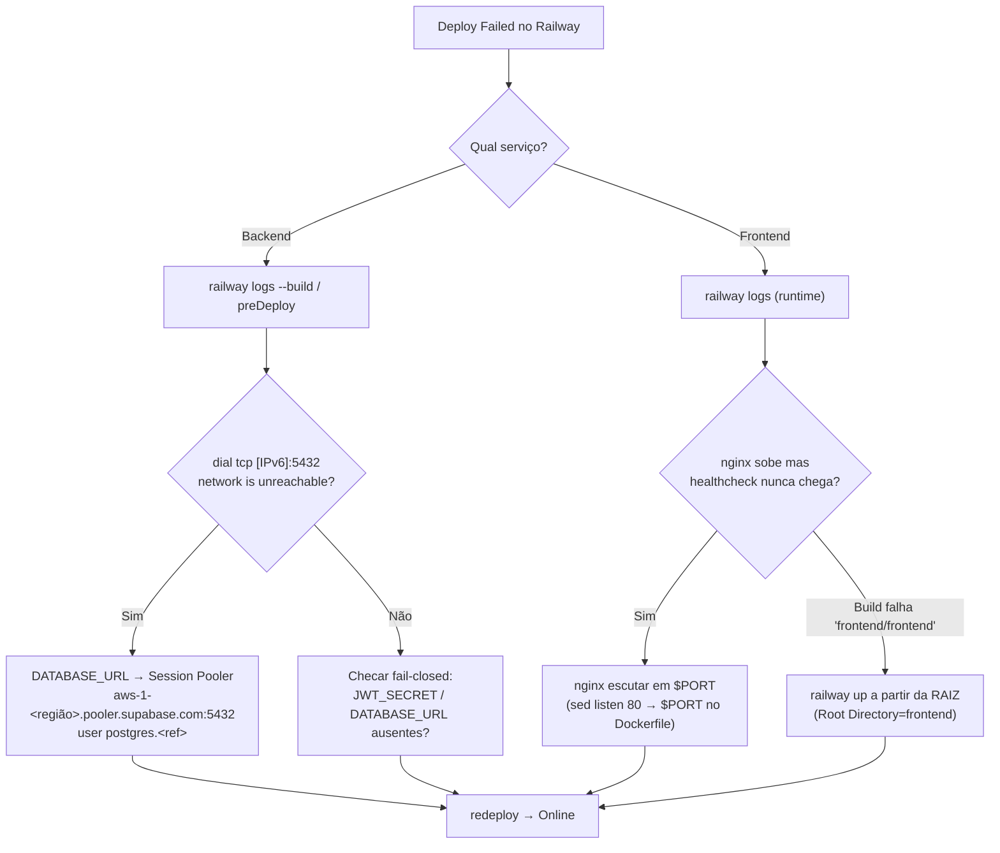
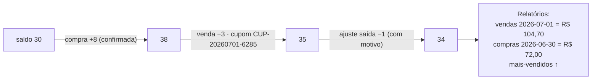

# Lições Aprendidas — Deploy da Fase 9 (Railway + Supabase)

Retrospectiva da subida do ERP para produção em **2026-07-01**. Registra a
topologia final, o passo a passo real, os **dois bugs de provedor** que só
apareceram fora da máquina local e as lições operacionais para o próximo deploy.

- **Backend:**  https://erp-estoque-backend-production.up.railway.app
- **Frontend:** https://erp-estoque-frontend-production.up.railway.app

> Guia operacional passo a passo: [setup/railway-deployment.md](setup/railway-deployment.md).
> Provisionamento do banco: [setup/supabase-setup.md](setup/supabase-setup.md).

---

## 1. Topologia de produção

O ponto não-óbvio está na aresta **backend → banco**: a conexão **direta** do
Supabase (`db.<ref>.supabase.co`) só publica registro **AAAA (IPv6)**, e o egress
do Railway é **IPv4** — por isso o caminho válido é o **Session Pooler** (Supavisor),
que é IPv4 na porta 5432.

---

## 2. Sequência real do deploy

Ordem que funcionou (cada seta é um comando/verificação de fato executado). O
frontend depende da URL do backend (build-time), e o CORS do backend depende da
URL do frontend — daí a ordem em ziguezague.

---

## 3. Mapa mental das lições

---

## 4. Runbook de troubleshooting (os dois bugs)

---

## 5. Lições em tabela (acionáveis)

| # | Sintoma | Causa raiz | Correção | Onde ficou registrado |
|---|---------|-----------|----------|----------------------|
| 1 | `migrate up` no preDeploy falha: `dial tcp [2600:…]:5432: network is unreachable` | Conexão direta do Supabase é **IPv6-only**; egress do Railway é **IPv4** | `DATABASE_URL` = **Session Pooler** (`aws-1-us-east-2.pooler.supabase.com:5432`, user `postgres.<ref>`, `sslmode=require`) | `railway.json`/env do backend · [supabase-setup.md](setup/supabase-setup.md) |
| 2 | Frontend fica `Failed`: nginx sobe e o Railway mata o container | nginx escutava fixo na **80**; o healthcheck do Railway bate em **`$PORT`** | `frontend/Dockerfile` reescreve `listen 80;` → `$PORT` no boot | `frontend/Dockerfile` (commit `c0d3df8`) |
| 3 | `railway whoami` → `Unauthorized` | Token era **project token**, não account token | Usar `RAILWAY_TOKEN` (project) p/ operar o projeto existente; account token só p/ criar projeto | [railway-deployment.md](setup/railway-deployment.md) |
| 4 | `railway up ./frontend --path-as-root` → build procura `frontend/frontend` | Serviço tem **Root Directory = `frontend`** | `railway up` a partir da **raiz** do repo | [railway-deployment.md](setup/railway-deployment.md) |
| 5 | Variáveis `DB_HOST=localhost` etc. no backend | Legado; **o código lê só `DATABASE_URL`** (`config.go`) | Remover `DB_*`/`APP_PORT` para não confundir debugging | — |
| 6 | Teste local passou, produção falhou | Bug era de **rede do provedor** (IPv6), invisível de uma máquina com IPv6 | Validar sempre no ambiente-alvo; logs de preDeploy são o primeiro lugar a olhar | esta retrospectiva |
| 7 | Risco: próximo push reverteria o frontend | Deploy inicial via `railway up` (arquivos locais), fora do git | Commitar o fix no `main` e redeployar **from-source** (auto-deploy correto) | commits `c0d3df8`, `73f5aab` |

---

## 6. Verificação de aceitação em produção

Ciclo real sobre "Cabo USB-C 2m 3A Trançado" (ledger append-only):

Todos os itens do **Critério de Aceitação** do brief foram marcados como cumpridos
em [todos.md](todos.md#critério-de-aceitação-conforme-brief-do-cliente).

---

## 7. Lições da integração Railway ↔ GitHub (CI/CD — 2026-07-01)

Gotchas encontrados ao conectar os serviços Railway ao repositório GitHub para
auto-deploy com Wait for CI.

### 7.1 "GitHub Repo not found" no campo de branch

**Sintoma:** o Source Repo está conectado (mostra o repo com botão Disconnect), mas
o campo "Branch connected to production" exibe `❌ GitHub Repo not found` e não abre
dropdown ao clicar.

**Causa:** o Railway GitHub App foi (re)autorizado mas ainda não tinha as permissões
novas aceitas, ou o cache da sessão estava desatualizado.

**Correção:** dar um **refresh na página** do Railway (F5). Se não resolver, clicar
no link *"accepted our updated GitHub permissions"* que aparece abaixo do toggle
"Wait for CI" — ele redireciona para o GitHub para aceitar as permissões adicionais
do App. Após aceitar, a lista de branches carrega normalmente.

### 7.2 Toggle "Wait for CI" volta para desligado

**Sintoma:** liga o toggle Wait for CI, a página salva, mas ao recarregar ele volta
para desligado.

**Causa:** o Railway não consegue persistir Wait for CI sem um branch válido
selecionado no campo "Branch connected to production".

**Correção:** selecionar o branch **primeiro** (passo 1), salvar, e só depois ligar
o Wait for CI (passo 2). A ordem importa.

### 7.3 Push do GitHub Actions bot não bloqueou o deploy

**Sintoma / dúvida:** a Action `promote-production.yml` empurra `main`→`production`
usando o `GITHUB_TOKEN` do bot — o Railway iria ignorar esse push?

**Resultado real:** não. O Railway detectou o push normalmente e iniciou o deploy.
O webhook do GitHub App do Railway dispara para qualquer push no branch tracado,
independente de quem empurrou (usuário ou bot).

### 7.4 Tabela de gotchas (resumo acionável)

| # | Sintoma | Causa | Correção |
|---|---------|-------|----------|
| 8 | "GitHub Repo not found" no campo de branch | Permissões do Railway GitHub App desatualizadas ou cache | Refresh na página; se persistir, aceitar permissões pelo link na tela |
| 9 | Wait for CI volta para desligado após salvar | Branch não estava selecionado quando tentou salvar | Selecionar branch primeiro → salvar → ligar Wait for CI |
| 10 | Push do bot não dispara deploy no Railway | — (não aconteceu) | Webhook do Railway App dispara para qualquer push, inclusive de bot |

---

## 8. Lições da ativação da observabilidade (Grafana Cloud + Alloy — 2026-07-01)

Ligamos o **push gerenciado** de métricas (backend `/metrics` protegido → Grafana
Alloy no Railway → `remote_write` pro Grafana Cloud → 4 alertas no ruler). Os
tropeços foram quase todos de **credencial/roteamento** e de confundir camadas.

- **Repo tem a receita; segredo mora no Railway (é manual, aceite).** Variável de
  ambiente **não** vem de `.env` do repo e **merge não carrega valores** — eles são
  digitados nas _Variables_ do serviço no dashboard, uma vez. Os `*.env.production.example`
  são só a checklist versionada.
- **Dois tokens distintos** (confundir custou horas): `METRICS_TOKEN` (backend) =
  `ERP_METRICS_TOKEN` (Alloy) autentica o **scrape**; `GRAFANA_CLOUD_TOKEN`
  autentica o **remote_write**. São mundos diferentes.
- **Duas pernas independentes:** Alloy→backend (scrape, define o _valor_ de `up`) e
  Alloy→Grafana Cloud (entrega). Consertar o remote_write **revelou** que o scrape
  estava falhando (`up=0`) — estava mascarado enquanto nada chegava.
- **Endereço privado no Railway:** `${{svc.RAILWAY_PRIVATE_DOMAIN}}:${{svc.APP_PORT}}`.
  Use `APP_PORT` (existe); `PORT` não existe → `${{...PORT}}` resolve **vazio** →
  `host:` (porta em branco) → `up=0`.
- **`absent()` é gráfico invertido:** linha em **1** = série ausente (firing); a linha
  **sumir** = saudável. Confirme sempre no positivo (`up{job="erp-api"}` = 1).
- **`/metrics` é fail-safe:** em produção sem `METRICS_TOKEN`, responde **404**
  (fechado por padrão) — seguro, mas lembre de setar o token para habilitar o scrape.

### 8.1 Tabela de gotchas (resumo acionável)

| # | Sintoma | Causa | Correção |
|---|---------|-------|----------|
| 11 | mimirtool `404 requested resource not found` | `--address` era o endpoint de push (`/api/prom/push`) | usar o **host base** do stack |
| 12 | mimirtool `401 invalid scope requested` | token sem `rules:read`/`rules:write` | adicionar escopos `rules:*` na Access Policy → token novo |
| 13 | Alloy `401 invalid token` no remote_write | `GRAFANA_CLOUD_TOKEN` velho/revogado ou sem `metrics:write` (ou `USER` ≠ instance ID) | token novo com `metrics:write` nas Variables → redeploy |
| 14 | `up=0` / `ERPBackendDown` firing | `ERP_METRICS_ADDR` com `${{...PORT}}` (porta vazia) ou `ERP_METRICS_TOKEN` ≠ `METRICS_TOKEN` | usar `APP_PORT`; igualar os tokens de scrape |

Guia operacional passo a passo (com troubleshooting completo):
[setup/observability-activation.md](setup/observability-activation.md).

---

## 9. Checklist do próximo deploy (destilado)

- [ ] `DATABASE_URL` = **Session Pooler** (IPv4, 5432), nunca a direta nem o Transaction Pooler (6543).
- [ ] `JWT_SECRET` longo e único (`openssl rand -base64 64`), nunca o default de dev.
- [ ] Backend primeiro: `DATABASE_URL`, `JWT_SECRET`, TTLs, `CEP_API_URL`, `APP_ENV=production`.
- [ ] Gerar domínio do backend → setar `VITE_API_BASE_URL` no frontend **antes** do build.
- [ ] `railway up` do frontend **a partir da raiz** do repo (Root Directory = `frontend`).
- [ ] Gerar domínio do frontend → `ALLOWED_ORIGINS` no backend → redeploy.
- [ ] Verificar: `/health` (200) dos dois, login, preflight CORS, e um ciclo de negócio.
- [ ] Garantir que os fixes de infra estão **commitados no `main`** (auto-deploy do GitHub).
- [ ] **Observabilidade (opcional):** `METRICS_TOKEN` no backend; serviço Alloy com
  as 5 vars (`ERP_METRICS_ADDR` via `APP_PORT`, `ERP_METRICS_TOKEN` = do backend,
  `GRAFANA_CLOUD_*`); `mimirtool rules load` (host base + token `rules:*`);
  verificar `up{job="erp-api"}=1`.
