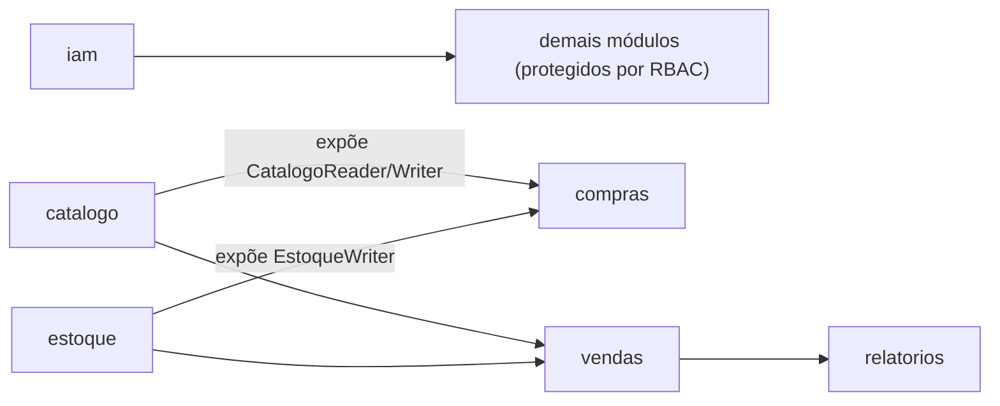
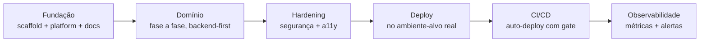

# Playbook de Planejamento e Execução de Fases

> **Método destilado deste projeto**, para reaproveitar em projetos futuros. Descreve
> *como* planejar e executar um sistema em fases — não o que este ERP faz. O
> companheiro mecânico é o esqueleto preenchível em
> [templates/PROMPT.template.md](templates/PROMPT.template.md); o contrato de processo
> detalhado (D1–D3, protocolo do juiz) vive em [mandates.md](mandates.md).

## O método em uma frase

**Desenvolvimento guiado por especificação executável, em fases ordenadas por
dependência, com um Definition of Done por tarefa validado por um juiz independente.**
Três marcas distinguem este método da maioria:

1. O **critério de aceitação de cada fase é um comando shell** que imprime `PASS`.
2. O **teste entra no mesmo passo** que o código (nunca numa "fase de testes" no fim).
3. Um **agente-juiz adversarial** julga o diff contra a spec e **bloqueia** o avanço.

## Quando usar

- Projeto novo com escopo conhecido que dá para decompor em módulos/fases.
- Retomada de um projeto: cada nova capacidade grande vira uma "fase" com o mesmo ciclo.
- Qualquer trabalho onde "parece pronto" não basta e você quer um portão objetivo.

Para um bugfix pontual ou tarefa de uma linha, o ciclo completo é peso morto — use o
bom senso.

## Camada 1 — O sistema de documentos

O que faz o método funcionar não é um documento; é a **separação de papéis**. Cada
arquivo responde a *uma* pergunta e não duplica os outros:

| Documento | Pergunta que responde | Muda quando |
|---|---|---|
| `PROMPT.md` (spec executável) | *O que* construir e em que ordem | Raramente — é a estrela-guia |
| `mandates.md` | *Como saber que terminou* (D1–D3, juiz) | Quase nunca |
| `CLAUDE.md` | *Como operar* (comandos, anatomia de módulo) | Quando a stack muda |
| `todos.md` | *Onde estamos* (checklist vivo) | A cada tarefa |
| `licoes-aprendidas.md` | *O que aprendemos apanhando* | Depois de cada fase difícil |
| `release.md` | *O que mudou pra fora* (changelog) | A cada release |

**Regra de desempate obrigatória:** em conflito, a spec (`PROMPT.md`) vence e os
outros se corrigem. Sem isso, os documentos divergem e ninguém sabe qual é a verdade.

## Camada 2 — Leis vs Regras (as duas listas que quase nunca mudam)

Separe **invariantes** de **procedimentos** — são coisas diferentes:

- **Leis (L1..Ln) — invariantes de arquitetura que *nunca* podem quebrar.** Curtas,
  numeradas, verificáveis. Exemplos reais deste projeto: "um módulo nunca importa o
  interno de outro", "dependências apontam pra dentro", "sem FK entre schemas", "toda
  rota protegida tem RBAC", "saldo nunca negativo", "ledger append-only". São o que o
  juiz confere primeiro.
- **Regras (R1..Rn) — como escrever o código.** Também numeradas. Exemplos: "leia o
  arquivo antes de editar", "compile após cada arquivo", "sem stub/TODO/panic", "DTO no
  handler, nunca a entidade de domínio".

Se você está tentado a misturar as duas listas, é sinal de que a lei não é invariante
ou a regra não é procedimento. Mantenha-as separadas.

## Camada 3 — Como quebrar em fases

1. **Desenhe o grafo de dependências entre módulos** antes de ordenar. Quem é
   *consumido* vem antes de quem *consome*.
2. **Ordene as fases por esse grafo.** Regra de ouro adicional: backend antes do
   frontend (o front consome a API); a partir dos cadastros dá para paralelizar.
3. **Escolha um módulo de referência canônico** e mande replicar a estrutura em cada
   fase. Corta fadiga de decisão e garante consistência.
4. **Dê a cada fase um critério de aceitação executável** — um comando que imprime
   `PASS Fx`. Ele é o **piso, não o teto**.

Exemplo (grafo deste projeto):



## Camada 4 — O micro-ciclo por tarefa (D1–D3)

Toda tarefa segue o mesmo loop, nesta ordem:

```
implementar → D1 (testes no mesmo passo) → D2 (checklist [x]) → critério curl/PASS → D3 (juiz CONFORME)
```

- **D1 — testes junto.** Metas objetivas de cobertura, medidas por ferramenta (aqui:
  `domain/` ≥ 80%, `application/` ≥ 70% via `go test -cover`). Cada invariante e cada
  erro sentinela tem teste.
- **D2 — checklist vivo.** Derive o checklist *antes* de codar; marque `[x]` só o que
  está feito **e** verificado.
- **D3 — juiz independente.** Um agente *diferente* de quem implementou julga o diff
  contra a spec + Leis e devolve `CONFORME` / `NÃO CONFORME` (com `arquivo:linha`).
  `NÃO CONFORME` bloqueia a fase. Protocolo e prompt-template do juiz em
  [mandates.md](mandates.md#protocolo-do-agente-juiz).

## Camada 5 — O macro-ciclo de maturidade

As fases de *domínio* são só o meio. O arco completo, que se repete de projeto pra
projeto, é uma escada de maturidade:



Traduzindo: primeiro *funciona local*, depois *é seguro/acessível*, depois *está no
ar*, depois *sobe sozinho*, depois *é observável*. Não pule etapas — cada uma
pressupõe a anterior estável.

## Armadilhas conhecidas (lições que só aparecem executando)

Vieram da prática deste projeto e valem como checklist de risco:

- **Buraco na cobertura backend × frontend.** Um endpoint pode existir sem tela (ou
  vice-versa) — aconteceu aqui com a gestão de usuários. A decomposição por fases não
  pega isso sozinha: **cruze explicitamente** "capacidades do backend" × "telas do
  frontend" ao planejar.
- **Bug de provedor não aparece local.** Rede, portas, IP (IPv6-only, `$PORT`) só
  quebram no ambiente-alvo. **Rode o critério `PASS` no destino**, não só na sua máquina.
- **Backlog deferido precisa de justificativa escrita** (escopo + risco + porquê).
  "Não vou fazer agora" documentado vale tanto quanto "fiz".

## Checklist de arranque de um projeto novo

Antes de escrever qualquer linha de código:

- [ ] Escrever o **§0 "leia, não implemente"**: contexto de negócio + **critério de
  aceitação do cliente** (uma frase testável) + stack + grafo de dependências.
- [ ] Declarar as **Leis** (invariantes) e as **Regras** (procedimentos), separadas.
- [ ] Escolher o **módulo de referência canônico**.
- [ ] Quebrar em **fases ordenadas por dependência**, cada uma com **critério `PASS`
  executável**.
- [ ] Fixar o **Definition of Done** (D1/D2/D3) num doc de processo separado
  ([mandates.md](mandates.md)).
- [ ] Criar o **checklist vivo** ([todos.md](todos.md)) e o **changelog**
  ([releases/release.md](releases/release.md)) vazios.
- [ ] Preencher a spec a partir de [templates/PROMPT.template.md](templates/PROMPT.template.md).

Depois de cada fase difícil, escrever a **retrospectiva acionável** (tabela sintoma →
causa → correção → onde ficou registrado), no formato de
[licoes-aprendidas.md](licoes-aprendidas.md).
