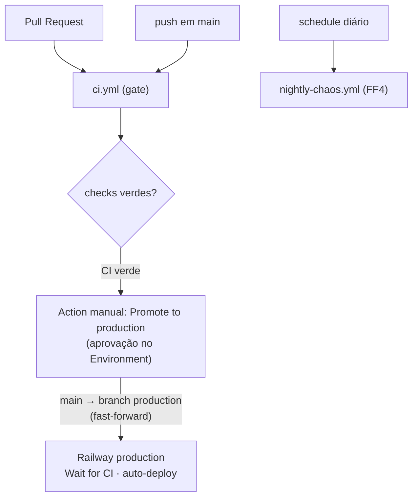

# CI/CD — GitHub Actions + Railway

A esteira usa **GitHub Actions como gate de qualidade** e o **auto-deploy nativo do
Railway** para publicar. O Railway só deploya um commit depois que os checks ficam
verdes (setting **"Wait for CI"**). Não há `RAILWAY_TOKEN` no GitHub.

## Fluxo



PR → CI → merge em `main` → *(CI verde)* → Action manual **Promote to production**
(aprovação no GitHub Environment) empurra `main`→`production` → Railway deploya.

Não há ambiente de staging por enquanto. O branch `production` é o único gatilho
de deploy; `main` só dispara o CI gate.

## Workflows

| Arquivo | Gatilho | O que faz |
|---------|---------|-----------|
| [`.github/workflows/ci.yml`](../../.github/workflows/ci.yml) | PR + push `main` | Gate de qualidade (jobs abaixo) |
| [`.github/workflows/promote-production.yml`](../../.github/workflows/promote-production.yml) | Manual (`workflow_dispatch`) | Fast-forward `main`→`production` com aprovação |
| [`.github/workflows/nightly-chaos.yml`](../../.github/workflows/nightly-chaos.yml) | Cron diário + manual | FF4 (chaos) num stack efêmero — não bloqueia |

### Jobs do `ci.yml` (nomes = *required checks*)

- **`backend-test`** — `go vet` + `go test -cover` (sempre) e `go test -race` (só no
  `main`); depois **FF1** (boundary isolation, estático). Go vem de
  `backend/go.mod` (`go-version-file`).
- **`frontend`** — `pnpm install --frozen-lockfile` + `pnpm lint` + `pnpm build`
  (tsc + vite). Node vem do `.nvmrc`; pnpm 9.
- **`build-images`** — `docker build` do backend e do frontend (sem push): garante que
  os Dockerfiles compilam (pega regressões como o fix do `$PORT`).
- **`integration`** — sobe `db + migrate + api` via `docker compose`, espera `/health`
  e roda as fitness functions:
  - **gate (bloqueia):** `run_all.py ff1 ff2` (boundary + contratos/RBAC).
  - **informativo (não bloqueia):** `run_all.py ff3` (p99) com `continue-on-error` e
    `P99_LIMIT_MS=800` — runner compartilhado é ruidoso demais para a p99 ser gate.

FF4 (chaos) **não** roda no `ci.yml` — fica no `nightly-chaos.yml` (destrutivo).

## Fitness functions localmente

```bash
make up               # sobe o stack (db + migrate + api + frontend)
make fitness          # roda FF1+FF2+FF3 (FF4 pede FF4_ENABLE=1)
make fitness-static   # só FF1 (estático, não precisa de stack)

# subconjuntos diretos:
python3 scripts/fitness-functions/run_all.py ff1 ff2
FF4_ENABLE=1 python3 scripts/fitness-functions/run_all.py ff4
```

`run_all.py` aceita uma ou mais FFs no argv (`ff1`..`ff4`); sem args roda todas.
Dependências em [`scripts/fitness-functions/requirements.txt`](../../scripts/fitness-functions/requirements.txt)
(`httpx`).

## Ambiente no Railway

Um único environment `production` no projeto `erp-estoque`:

| | `production` |
|---|---|
| Branch tracado | `production` |
| Deploy | auto (após promoção via Action) |
| `DATABASE_URL` | Session Pooler do Supabase (IPv4) |
| Migrations | automáticas (preDeploy `/app/migrate up`) |

> **`DATABASE_URL` = Session Pooler (IPv4).** A conexão direta do Supabase é IPv6-only
> e o egress do Railway é IPv4 — ver [licoes-aprendidas.md](../licoes-aprendidas.md) e
> [supabase-setup.md](supabase-setup.md).

## Configuração manual (uma vez, no painel)

Não versionável — configurar nos dashboards:

1. **Railway → serviços backend e frontend:** Settings → conectar ao repositório GitHub
   e selecionar **branch `production`** como branch de deploy.
2. **Railway → cada serviço:** Settings → ativar **"Automatic Deployments"** +
   **"Wait for CI"** (só deploya commit com checks verdes).
3. **GitHub → Settings → Environments → `production`:** adicionar **Required reviewers**
   (gate de aprovação do `promote-production.yml`).
4. **GitHub → Branch protection do `main`:** exigir PR e os checks required por nome —
   `backend-test`, `frontend`, `build-images`, `integration`. (FF3 é informativo e
   **não** é required check.)
5. **GitHub → Branch protection do `production`:** exigir status checks e **restringir
   push direto**; incluir o *GitHub Actions bot* no bypass para a Action de promoção
   conseguir empurrar o fast-forward.

## Troubleshooting da configuração Railway

| Sintoma | Causa | Solução |
|---------|-------|---------|
| Campo "Branch connected to production" mostra `❌ GitHub Repo not found` e não abre | Railway GitHub App sem permissões atualizadas / cache | Dar **refresh na página**; se persistir, clicar em *"accepted our updated GitHub permissions"* (link abaixo do toggle Wait for CI) |
| Toggle "Wait for CI" volta para desligado após salvar | Branch não estava selecionado quando salvou | Selecionar o branch **primeiro**, salvar, **depois** ligar Wait for CI |
| Push do GitHub Actions bot não dispara deploy | — (não ocorre na prática) | O webhook do Railway App dispara para qualquer push no branch tracado, inclusive de bot |

## Promoção para produção

1. Actions → **Promote to production** → *Run workflow*.
2. Aprovar no Environment `production`.
3. A Action verifica que é fast-forward (`main` à frente de `production`) e empurra
   `main`→`production`; o Railway deploya após o CI verde no branch `production`.
4. Verificar `/health` do backend e do frontend e o login admin (runbook em
   [licoes-aprendidas.md](../licoes-aprendidas.md)).

> Se a Action falhar em "não é fast-forward", `production` divergiu de `main` —
> reconcilie manualmente antes de repetir (a Action nunca faz force-push).
